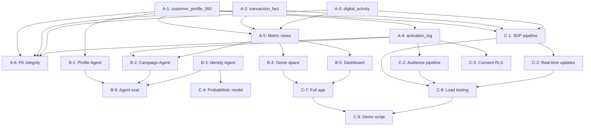

# CustomerLake Readiness Project Plan

Catalog: `cdm_tmforum`. Status: planning. Revised 2026-09-28.

CustomerLake is Databricks' agentic Customer Data Platform (CDP), announced June 2026 (Private Preview). It is embedded natively in the lakehouse and unifies customer data, AI models, agents, identity resolution, audience building, and activation — governed by Unity Catalog.

This plan maps `cdm_tmforum` to full CustomerLake demo readiness.

---

## 1. Current state assessment

### 1.1 Catalog inventory

| Schema | Populated tables | Stub tables | Purpose |
|---|---|---|---|
| `tmf_customer` | 32 | 53 | Customer, billing, payments, interactions, orders, dunning |
| `tmf_product` | 36 | 64 | Product catalog, offerings, pricing, usage |
| `tmf_service` | 32 | 0 | Service catalog, CFS/RFS, SLAs, performance |
| `tmf_resource` | 31 | 0 | Physical/logical network assets, devices |
| `tmf_businesspartner` | 58 | 0 | Partner roles, settlements, revenue sharing |
| `tmf_enterprise` | 56 | 0 | Workforce, revenue assurance, security |
| `tmf_marketsales` | 9 | 0 | Policy rules (campaigns in bronze/marketing instead) |
| `tmf_shared` | 16 | 0 | Party, address, contact medium, digital identity |
| `identity` | 17 | 0 | Entity registry, crosswalks, match decisions, survivorship |
| `gold` | 18 | 0 | Account 360, Org 360, installed base, typed relationships |
| `marketing` | 13 | 0 | Eligibility, audiences, consent, attribution, campaigns |
| `silver` | 18 | 0 | SID-aligned observations, customer crosswalk |
| `bronze` | 8 | 0 | SaaS-shaped ingested payloads |
| `salesforce_source` | 10 | 0 | Accounts, contacts, contracts, opportunities, CPQ quotes |
| `oracle_erp_source` | 11 | 0 | GL, AR, billing rates, revenue schedules |
| `mdm_source` | 2 | 0 | Customer crosswalk (SF ↔ Oracle ↔ TMF) |
| `_metrics` | 94 | 0 | Pre-computed metric views across all domains |
| `ops` | 9 | 0 | Ingestion logs, publication manifests |
| `simulation_truth` | 8 | 0 | Restricted evaluation truth for identity resolution |

Total: 25 active schemas, 780+ objects including 94 metric views.

### 1.2 Key entity volumes

| Entity | Table | Rows |
|---|---|---|
| Parties (individuals + orgs) | `tmf_shared.party` | 10,000 |
| Customers | `tmf_customer.customer` | 10,000 |
| Resolved entities | `identity.entity_registry` | 35,671 |
| Source-to-entity crossrefs | `identity.entity_xref` | 60,700 |
| Match decisions | `identity.match_decision` | 97,783 |
| Typed relationships | `gold.typed_relationship` | 254,209 |
| Account 360 records | `gold.account_360` | 10,000 |
| Organization 360 records | `gold.organization_360` | 5,331 |
| Installed base (services) | `gold.installed_base` | 100,000 |
| Customer interactions | `tmf_customer.interaction` | 100,000 |
| Applied billing rates | `tmf_customer.applied_billing_rate` | 100,000 |
| Bills | `tmf_customer.bill` | 10,000 |
| Payments | `tmf_customer.payment` | 10,000 |
| Audience memberships | `marketing.audience_snapshot` | 55,745 |
| Campaign events | `marketing.campaign_event` | 18,068 |
| Consent records | `marketing.consent_event` | 38,632 |
| Marketing eligibility | `marketing.marketing_eligibility` | (derived) |
| Campaign attributions | `marketing.campaign_attribution` | (derived) |
| Salesforce accounts | `salesforce_source.account` | (source) |
| Salesforce contacts | `salesforce_source.contact` | (source) |

---

## 2. CustomerLake domain mapping

CustomerLake requires six functional domains. Assessment of each against `cdm_tmforum`:

### 2.1 Customer profiles / Customer 360 — ✅ STRONG

**Required:** Unified golden record per customer with demographics, contact info, lifecycle status, preferences.

**Available:**
- `tmf_shared.party` — 10K parties with demographics, contact, consent flags
- `tmf_customer.customer` — 10K customer records with lifecycle, billing, credit, churn risk
- `gold.organization_360` — 5.3K resolved org profiles with hierarchy rollups
- `gold.account_360` — 10K typed account roles (customer, payer, beneficiary, reseller)
- `salesforce_source.account` / `salesforce_source.contact` — CRM source records
- `tmf_shared.contact_medium` — multi-channel contact preferences
- `tmf_shared.digital_identity` — authentication, MFA, session tracking

**Gap:** No single unified `customer_profile_360` view that merges party demographics + identity resolution + account status + installed base + interaction recency + consent into one row per entity. All underlying data exists; the join is missing.

### 2.2 Identity resolution / identity graph — ✅ STRONG

**Required:** Deterministic and probabilistic matching, golden record creation, merge/split history, steward workflow.

**Available:**
- `identity.entity_registry` — 35.7K durable resolved entities (org/individual domain separation)
- `identity.entity_xref` — 60.7K source-to-entity crossreferences with scoped identity keys
- `identity.match_decision` — 97.8K decisions with full audit trail
- `identity.candidate_pair` — candidate pairs with evidence and conflict tracking
- `identity.identifier_assertion` — namespace-scoped identifier verification
- `identity.attribute_survivorship` — source value selection with reason
- `identity.identity_change` — merge/split/unmerge lifecycle log
- `identity.entity_version` — bitemporal version history
- `silver.sid_customer_crosswalk` — SF ↔ Oracle ↔ TMF crosswalk
- `mdm_source.customer_crosswalk` — MDM golden customer_id mapping
- Steward views: `v_decision_review_queue`, `v_identifier_conflicts`, `v_merge_split_history`, `v_entity_resolution_audit`, `v_low_confidence_memberships`

**Gap:** None material. This is a textbook identity resolution implementation. CustomerLake's Agentic Identity Resolution would layer on top of this existing foundation.

### 2.3 Interactions / engagement — ✅ STRONG

**Required:** Event-level customer interactions across channels — support, sales, marketing, digital.

**Available:**
- `tmf_customer.interaction` — 100K interactions with channel, category, CSAT, SLA tracking, escalation, resolution
- `marketing.campaign_event` — 18K campaign touches (sends, opens, clicks, responses, meetings)
- `tmf_customer.customer_problem` — service problems linked to customers
- `tmf_customer.billing_dispute` — 100K billing dispute lifecycle records
- `bronze.mktg_campaign_events` — raw campaign event payloads

**Gap:** No digital behavioral event stream (web/app clickstream, product-usage events, login activity). `tmf_shared.digital_identity` tracks authentication but not behavioral events. A synthetic `digital_activity` table would significantly strengthen the demo.

### 2.4 Transactions / billing — ✅ ADEQUATE (needs gold view)

**Required:** Purchase, invoice, payment, and billing events keyed to unified customer IDs.

**Available (populated, with data):**
- `tmf_customer.applied_billing_rate` — 100K charge/credit/discount/tax/rebate events
- `tmf_customer.bill` — 10K customer invoices
- `tmf_customer.payment` — 10K payments
- `tmf_customer.bill_adjustment` — 100K post-bill adjustments
- `tmf_customer.billing_account_balance` — 1K account balance states
- `tmf_customer.billing_statistic` — 10K aggregated billing stats (ARPU, usage)
- `tmf_customer.fee_charge` — 100K fee charges
- `tmf_customer.dunning_case` — 100K dunning lifecycle records
- `tmf_customer.billing_dispute` — 100K disputes
- `tmf_customer.billing_rate_spec` — 10K rate specifications
- `tmf_customer.payment_item` — payment line-item allocations
- `tmf_customer.payment_arrangement` — payment arrangements

**Gap:** These tables use `customer_id` FK but are not yet joined through the identity crosswalk to `entity_id`. A gold-layer `transaction_fact` view joining `applied_billing_rate` + `bill` + `payment` through `identity.entity_xref` would complete the CustomerLake transaction domain.

### 2.5 Segments / audiences — ✅ STRONG

**Required:** Segment definitions, audience membership, refresh timestamps, consent-gated activation lists.

**Available:**
- `marketing.audience_snapshot` — 55.7K versioned audience memberships (RENEWAL_PIPELINE, UPSELL_TARGETS, WINBACK_CANDIDATES) with deduplication
- `marketing.marketing_eligibility` — per-person × org role × contact × purpose × channel eligibility evaluation
- `marketing.consent_event` — 38.6K consent records per party + channel with opt-in/DNC flags
- `marketing.campaign_attribution` — last-touch 30-day attribution with conversion allocation
- `marketing.campaign_measurement` — aggregated campaign metrics
- `tmf_product.segment_targeting` — product-to-segment fit scoring
- `tmf_marketsales.policy_rule` / `policy_condition` — policy engine for marketing rules

**Gap:** No real-time segment membership refresh mechanism or segment builder UI integration. Static snapshots are sufficient for demo but CustomerLake's Campaign Agents expect dynamic segment refresh.

### 2.6 Activation / channel push — ⚠️ GAP

**Required:** Outbound activation records — audience pushed to email platform, ad network, SMS gateway, or CRM list.

**Available:** Nothing. Audience snapshots exist but no record of activation events (send to Braze, push to Google Ads, sync to Salesforce Campaign, etc.).

**Gap:** Need an `activation_log` table capturing: audience_snapshot_id, entity_id, destination_system, destination_type (email, ads, CRM), pushed_at, delivery_status, match_rate. This completes the "closed loop" story that CustomerLake's Campaign Agents demonstrate.

---

## 3. Release plan

### Release A: CustomerLake Data Foundation (demo-ready in 1–2 days)

Minimum viable CustomerLake demo. Build the missing views and one synthetic table.

| Task | Owner | Depends on | Deliverable | Acceptance criteria |
|---|---|---|---|---|
| A-1. Unified customer profile view | @data-engineer | — | `gold.customer_profile_360` | One row per entity_id. Merges: party demographics, identity resolution metadata, account status, installed base summary (service count, product types), last interaction date, consent flags, churn risk score, ARPU tier. All columns documented. |
| A-2. Transaction fact view | @data-engineer | — | `gold.transaction_fact` | Joins `applied_billing_rate` + `bill` + `payment` through `identity.entity_xref` to `entity_id`. Grain: one row per billing event. Includes: entity_id, transaction_type (charge/credit/payment/adjustment), amount, currency, billing_period, product_reference, service_reference. |
| A-3. Digital activity table (synthetic) | @data-engineer | — | `gold.digital_activity` | 50K–100K synthetic behavioral events. Columns: entity_id, event_type (page_view, login, feature_use, app_open, search, support_portal_visit), channel (web, mobile_app, self_service_portal), session_id, event_timestamp, page_or_feature, duration_seconds, device_type. FK integrity with `identity.entity_registry`. |
| A-4. Activation log table (synthetic) | @data-engineer | A-1 | `marketing.activation_log` | 5K–10K synthetic activation records. Columns: activation_id, audience_snapshot_id (FK), entity_id, destination_system (Braze, Google_Ads, Salesforce_Campaign, Meta_Custom_Audience), destination_type (email, paid_social, crm_list, sms), pushed_at, delivery_status (delivered, bounced, matched, unmatched), match_rate. |
| A-5. CustomerLake metric views | @data-analyst | A-1, A-2 | `_metrics.customerlake_*` | Metric views: profile completeness, identity resolution coverage, transaction summary, audience reach, activation delivery rate. |
| A-6. Verify FK integrity | @qa | A-1 through A-4 | Validation notebook | All entity_id FKs resolve. No orphan crossrefs. Synthetic data uses valid parent keys. |

**Completion evidence:** Unified profile query returns one row per entity with all six domains populated. Transaction view reconciles to source billing amounts. Digital events span 90 days with realistic distributions. Activation log shows audience → channel → delivery lifecycle.

### Release B: Agentic CustomerLake Demo (3–5 days after A)

Showcase CustomerLake's three agent families: Profile Agents, Campaign Agents, and Identity Resolution Agents.

| Task | Owner | Depends on | Deliverable | Acceptance criteria |
|---|---|---|---|---|
| B-1. Profile Agent notebook | @ml-engineer | A-1 | Notebook: `customerlake/profile_agent` | Demonstrates agentic profile enrichment: given a partial customer record, agent queries across `customer_profile_360`, `identity.entity_xref`, and external enrichment to build/update the golden record. Uses Databricks AI functions or Foundation Model API. |
| B-2. Campaign Agent notebook | @ml-engineer | A-4, A-5 | Notebook: `customerlake/campaign_agent` | Demonstrates agentic audience building: given a natural language campaign brief ("target enterprise customers with expiring agreements and high churn risk"), agent builds SQL segment, evaluates eligibility/consent, produces activation-ready audience, and simulates push to destination. |
| B-3. Identity Resolution Agent notebook | @ml-engineer | — | Notebook: `customerlake/identity_agent` | Demonstrates agentic identity resolution: given ambiguous source records, agent uses `identity.candidate_pair` evidence, `identity.match_decision` patterns, and `identity.identifier_assertion` to recommend merge/split actions with confidence and explanation. |
| B-4. Genie space for CustomerLake | @data-analyst | A-1, A-5 | Genie space: `CustomerLake Explorer` | Natural language interface over `customer_profile_360`, `transaction_fact`, `audience_snapshot`, `activation_log`. Sample questions embedded. |
| B-5. AI/BI Dashboard | @data-analyst | A-5 | Dashboard: `CustomerLake Overview` | Executive dashboard: profile completeness, identity resolution health, audience sizes, campaign performance, activation delivery rates, revenue at risk. All backed by `_metrics.customerlake_*` views. |
| B-6. Agent evaluation | @qa | B-1, B-2, B-3 | Notebook: `customerlake/agent_eval` | MLflow GenAI evaluation of all three agents: correctness, hallucination rate, tool selection accuracy, response quality. Minimum 10 test cases per agent. |

**Completion evidence:** Three-scene demo flow: (1) Profile Agent enriches a new customer record, (2) Campaign Agent builds a winback audience from natural language, (3) Identity Agent resolves a duplicate. Dashboard shows real-time metrics. Genie answers ad-hoc questions.

### Release C: Production-Grade CustomerLake (1–2 weeks after B)

Harden for repeatable, governed production use.

| Task | Owner | Depends on | Deliverable | Acceptance criteria |
|---|---|---|---|---|
| C-1. Lakeflow SDP pipeline | @data-engineer | A-1, A-2, A-3 | Pipeline: `customerlake_gold_pipeline` | Declarative pipeline materializing `customer_profile_360`, `transaction_fact`, `digital_activity` with expectations (completeness > 95%, no null entity_id, amount reconciliation). Scheduled refresh. |
| C-2. Incremental audience refresh | @data-engineer | A-4 | Pipeline: `customerlake_audience_pipeline` | Incremental audience snapshot generation from eligibility → consent → deduplication → activation. Append-only audience_snapshot + activation_log with watermark. |
| C-3. Real-time profile updates | @data-engineer | C-1 | Streaming notebook | Structured Streaming job that processes new interactions, billing events, and digital activity into `customer_profile_360` aggregate columns (last_interaction_date, total_ltv, event_count_30d). |
| C-4. Probabilistic identity resolution | @ml-engineer | B-3 | Model: `customerlake_identity_model` | ML model for probabilistic matching on individual entities (name + email + phone fuzzy matching). Registered in UC Model Registry. Challenger to existing deterministic resolution. |
| C-5. Consent enforcement layer | @data-engineer | A-4 | Row-level security policies | UC row-level security on `activation_log` and `audience_snapshot` ensuring only consented records are visible to marketing activation roles. `do_not_contact = TRUE` → row suppressed. |
| C-6. External system federation | @data-engineer | — | Federation connections | Lakehouse Federation connections to demonstrate CustomerLake's ability to query across Databricks + external systems (Snowflake, BigQuery) without copying data. |
| C-7. End-to-end Databricks App | @app-developer | B-4, B-5 | App: `customerlake-demo` | Full-stack React/FastAPI app: profile search, audience builder, campaign dashboard, identity resolution steward view. Branded, accessible, responsive. |
| C-8. Load and latency testing | @qa | C-1, C-2, C-3 | Test report | Profile query < 3s at 100K entities. Audience build < 30s for complex segments. Pipeline refresh < 10 min end-to-end. |
| C-9. Documentation and demo script | @pm | All | `customerlake/resources/demo_script.md` | Scripted 20-minute demo covering all three CustomerLake agent families, dashboard walkthrough, and Genie Q&A. |

---

## 4. Data model: new objects

These are the specific new tables and views that do not yet exist in `cdm_tmforum`.

### 4.1 `gold.customer_profile_360` (view)

```
entity_id               STRING    -- FK to identity.entity_registry
entity_type             STRING    -- organization | individual
party_id                STRING    -- FK to tmf_shared.party
customer_id             STRING    -- FK to tmf_customer.customer
-- Demographics
name                    STRING    -- coalesced display name
family_name             STRING
given_name              STRING
organization_legal_name STRING
customer_segment        STRING
country_of_residence    STRING
preferred_language      STRING
preferred_contact_method STRING
primary_email           STRING
primary_phone           STRING
mobile_phone            STRING
-- Lifecycle
lifecycle_status        STRING
account_status          STRING
activation_date         DATE
churn_date              DATE
churn_risk_score        DOUBLE
cltv_score_bucket       STRING
arpu_tier               STRING
credit_class            STRING
vip_flag                BOOLEAN
-- Identity resolution
resolution_confidence   DOUBLE
source_count            INT       -- number of source systems contributing
xref_count              INT       -- number of crossreferences
match_rule_summary      STRING    -- dominant match rule
-- Installed base summary
active_service_count    INT
total_service_count     INT
product_types           STRING    -- comma-separated distinct product types
-- Interaction recency
last_interaction_date   TIMESTAMP
interaction_count_90d   INT
avg_csat_score          DOUBLE
open_problem_count      INT
-- Billing summary
total_billed_amount     DECIMAL(18,2)
total_paid_amount       DECIMAL(18,2)
outstanding_balance     DECIMAL(18,2)
billing_currency        STRING
-- Consent
consent_marketing       BOOLEAN
consent_profiling       BOOLEAN
consent_data_sharing    BOOLEAN
do_not_contact          BOOLEAN
-- Provenance
publication_id          STRING
snapshot_timestamp      TIMESTAMP
```

### 4.2 `gold.transaction_fact` (view)

```
transaction_id          STRING    -- source PK
entity_id               STRING    -- FK to identity.entity_registry (via crosswalk)
customer_id             STRING    -- FK to tmf_customer.customer
billing_account_id      STRING
transaction_type        STRING    -- charge | credit | payment | adjustment | fee | rebate | tax
transaction_subtype     STRING    -- recurring | one_time | usage | discount | etc.
amount                  DECIMAL(18,2)
currency_code           STRING
billing_period_start    DATE
billing_period_end      DATE
transaction_date        TIMESTAMP
product_reference       STRING
service_reference       STRING
rating_source           STRING    -- OCS, OFCS, BSCS, etc.
source_table            STRING    -- provenance: which tmf_customer table
```

### 4.3 `gold.digital_activity` (synthetic table)

```
activity_id             STRING    -- UUID PK
entity_id               STRING    -- FK to identity.entity_registry
party_id                STRING    -- FK to tmf_shared.party
event_type              STRING    -- page_view | login | feature_use | app_open | search |
                                  -- support_portal_visit | bill_view | payment_submit |
                                  -- plan_compare | chat_start
channel                 STRING    -- web | mobile_app | self_service_portal | ivr
session_id              STRING
event_timestamp         TIMESTAMP
page_or_feature         STRING    -- e.g. /account/billing, /plans/compare, /support/tickets
duration_seconds        INT
device_type             STRING    -- desktop | mobile | tablet
browser_or_app          STRING
referrer_source         STRING    -- direct | search | email_campaign | social
origin                  STRING    -- SYNTHETIC
simulation_run_id       STRING
```

### 4.4 `marketing.activation_log` (synthetic table)

```
activation_id           STRING    -- UUID PK
audience_snapshot_id    STRING    -- FK to marketing.audience_snapshot
audience_name           STRING
entity_id               STRING    -- FK to identity.entity_registry
party_id                STRING    -- FK to tmf_shared.party
contact_address         STRING    -- email, phone, or ad ID sent to
destination_system      STRING    -- Braze | Google_Ads | Salesforce_Campaign |
                                  -- Meta_Custom_Audience | Twilio | HubSpot
destination_type        STRING    -- email | paid_social | crm_list | sms | push_notification
pushed_at               TIMESTAMP
delivery_status         STRING    -- delivered | bounced | matched | unmatched | suppressed
match_rate              DOUBLE    -- platform match rate (0-1)
impression_count        INT       -- for paid channels
click_count             INT       -- for paid channels
cost_amount             DECIMAL(10,2)
cost_currency           STRING
purpose                 STRING    -- RENEWAL_OUTREACH | UPSELL | WINBACK | RETENTION
origin                  STRING    -- SYNTHETIC
simulation_run_id       STRING
```

---

## 5. CustomerLake agent architecture

CustomerLake defines three agent families. Map to `cdm_tmforum` data:

### 5.1 Profile Agents

**Purpose:** Automatically prepare, cleanse, and enrich raw customer data into trusted golden records.

**Data inputs:**
- `tmf_shared.party` + `tmf_customer.customer` → raw customer attributes
- `identity.entity_xref` → source record linkage
- `identity.attribute_survivorship` → which source value won and why
- `gold.customer_profile_360` → current golden record state
- `salesforce_source.*` → CRM enrichment
- `oracle_erp_source.*` → ERP enrichment

**Demo scenario:** New Salesforce contact arrives with partial data. Profile Agent queries across sources, resolves identity, fills missing attributes from Oracle ERP and TMF party, produces enriched golden record with confidence scores and provenance.

### 5.2 Campaign Agents

**Purpose:** Build audiences from natural language, evaluate eligibility and consent, activate to channels.

**Data inputs:**
- `gold.customer_profile_360` → segment criteria evaluation
- `marketing.marketing_eligibility` → eligibility + consent gating
- `marketing.audience_snapshot` → historical audience snapshots
- `marketing.consent_event` → consent state per party + channel
- `gold.renewal_exposure` → agreement expiry for renewal campaigns
- `marketing.activation_log` → activation delivery tracking
- `marketing.campaign_attribution` → attribution feedback loop

**Demo scenario:** "Build an audience of enterprise customers with agreements expiring in 90 days, churn risk > 0.7, who have consented to email marketing." Campaign Agent translates to SQL, evaluates against eligibility, deduplicates, produces activation-ready list, simulates push to Braze.

### 5.3 Identity Resolution Agents

**Purpose:** Resolve fragmented identities using deterministic, probabilistic, and agentic matching.

**Data inputs:**
- `identity.candidate_pair` → blocking and comparison evidence
- `identity.match_decision` → historical decisions and audit trail
- `identity.identifier_assertion` → namespace-scoped identifiers
- `identity.v_identifier_conflicts` → conflicting identifier tokens
- `identity.v_decision_review_queue` → cases requiring human review
- `identity.v_low_confidence_memberships` → uncertain matches
- `identity.v_dual_membership_conflicts` → post-resolution conflicts

**Demo scenario:** Two organization records share a DUNS number but have different names. Identity Agent examines all evidence (identifiers, addresses, contacts, services), weighs conflicting signals, recommends merge with confidence score and explanation. Steward approves or overrides.

---

## 6. Existing assets to reuse

Do not rebuild what already works. These are production-quality assets:

| Asset | Location | Reuse for CustomerLake |
|---|---|---|
| Identity resolution pipeline | `identity.*` (17 tables) | Foundation for Identity Agents — no changes needed |
| Typed relationship graph | `gold.typed_relationship` (254K edges) | Profile enrichment — traverse relationships to find related entities |
| Account 360 | `gold.account_360` + serving views | Profile Agent output validation |
| Organization 360 | `gold.organization_360` + hierarchy closure | Org-level profile aggregation |
| Installed base | `gold.installed_base` (100K services) | Product/service dimension for profiles |
| Renewal exposure | `gold.renewal_exposure` | Campaign Agent — agreement expiry targeting |
| Marketing eligibility | `marketing.marketing_eligibility` | Campaign Agent — consent-gated audience building |
| Audience snapshots | `marketing.audience_snapshot` (56K) | Campaign Agent — historical audience comparison |
| Campaign attribution | `marketing.campaign_attribution` | Campaign Agent — attribution feedback |
| Consent events | `marketing.consent_event` (39K) | Consent enforcement across all agents |
| Customer crosswalk | `silver.sid_customer_crosswalk` + `mdm_source.customer_crosswalk` | Identity Agent — cross-system resolution evidence |
| 94 metric views | `_metrics.*` | Dashboard and Genie KPIs |
| Salesforce source | `salesforce_source.*` (10 tables) | Profile Agent — CRM enrichment |
| Oracle ERP source | `oracle_erp_source.*` (11 tables) | Profile Agent — financial enrichment |
| Bronze ingestion | `bronze.*` (8 tables) | Existing Auto Loader patterns for new sources |

---

## 7. Governance and consent requirements

CustomerLake is governed by Unity Catalog. Requirements:

| Requirement | Current state | Action needed |
|---|---|---|
| UC catalog with managed Delta tables | ✅ `cdm_tmforum` | None |
| Column-level descriptions | ✅ Extensive (CEO semantic modeling mandate) | Extend to new objects |
| Row-level security for consent | ❌ Not implemented | Release C: RLS policies on activation tables |
| Tags for data classification | ✅ `copper-retirement`, `telco_project` tags exist | Add `customerlake` governed tag |
| Consent enforcement in queries | ✅ `marketing.consent_event` + eligibility gating | Formalize as UC policy |
| Audit trail for identity changes | ✅ `identity.identity_change` + `identity.match_decision` | None |
| Synthetic data provenance | ✅ `origin` + `simulation_run_id` columns throughout | Apply same pattern to new synthetic tables |
| PII handling | ⚠️ PII in `party`, `contact_medium` | Release C: dynamic masking or column-level ACLs |

---

## 8. Success criteria

### Release A (Foundation)
- [ ] `gold.customer_profile_360` returns one row per entity with ≥ 90% column fill rate
- [ ] `gold.transaction_fact` reconciles to `tmf_customer.applied_billing_rate` + `payment` within 0.01%
- [ ] `gold.digital_activity` contains 50K+ events spanning 90 days, all entity_id FK valid
- [ ] `marketing.activation_log` contains 5K+ records with valid audience_snapshot_id FKs
- [ ] All new objects have column-level descriptions per semantic modeling mandate
- [ ] 5+ new metric views in `_metrics` schema

### Release B (Agentic Demo)
- [ ] Profile Agent correctly enriches a partial record in < 10s
- [ ] Campaign Agent builds a valid consent-gated audience from natural language in < 30s
- [ ] Identity Agent provides explainable merge/split recommendation with evidence
- [ ] Genie space answers 10 sample questions correctly
- [ ] Dashboard loads in < 5s with all widgets populated
- [ ] MLflow evaluation scores ≥ 0.8 on correctness across all three agents

### Release C (Production)
- [ ] SDP pipeline refreshes all gold views in < 10 min
- [ ] Incremental audience refresh processes new events within 5 min
- [ ] RLS consent enforcement verified: suppressed records not visible to marketing role
- [ ] Probabilistic model improves individual resolution F1 by ≥ 5% over deterministic baseline
- [ ] End-to-end app demo completes in ≤ 20 minutes

---

## 9. Risks and mitigations

| Risk | Impact | Likelihood | Mitigation |
|---|---|---|---|
| CustomerLake Private Preview API changes | Tasks B-1 through B-3 may need rework | Medium | Build agents on Foundation Model API + AI functions (stable). Adapt to CustomerLake-specific APIs when GA. |
| Synthetic data unrealism | Demo credibility | Low | Reuse existing simulation patterns from `bronze` ingestion. FK integrity enforced by validation notebook. |
| Identity resolution agent hallucination | Incorrect merge/split recommendations | Medium | Constrain agent to existing `match_decision` patterns. MLflow eval with ground truth from `simulation_truth`. |
| Billing data complexity | Transaction fact join errors | Low | TMF SID billing model is well-documented. Reconciliation check in acceptance criteria. |
| Consent enforcement gaps | Regulatory risk in demo narrative | Low | Existing `consent_event` + `marketing_eligibility` pipeline is proven. Extend, don't rebuild. |
| Performance at scale | Slow profile/audience queries | Low | Pre-aggregate in materialized views. Current volumes (100K entities) are well within serverless SQL capacity. |

---

## 10. Dependencies and sequencing



**Critical path:** A-1 → A-5 → B-5 → C-7 → C-9 (profile view → metrics → dashboard → app → demo script)

**Parallel tracks:**
- Track 1: A-1, A-2 (views over existing data — can start immediately)
- Track 2: A-3, A-4 (synthetic data generation — can start immediately)
- Track 3: B-1, B-2, B-3 (agent notebooks — start after Release A)
- Track 4: C-4 (probabilistic model — independent of Release B dashboard/app)

---

## 11. Estimated effort

| Release | Estimated duration | Prerequisite |
|---|---|---|
| A: Data Foundation | 1–2 days | Catalog access, serverless compute |
| B: Agentic Demo | 3–5 days after A | Foundation Model API access, Genie enabled |
| C: Production Grade | 1–2 weeks after B | CustomerLake Private Preview access, App deployment |

Release A is the minimum viable demo. A-1 and A-2 are SQL views over existing data and can be built in hours. A-3 and A-4 require synthetic data generation following established patterns from the `bronze` schema.

---

## 12. Open questions

1. **CustomerLake Private Preview access:** Is the workspace enrolled? If not, Releases A and B can proceed with Foundation Model API; CustomerLake-specific APIs deferred to C.
2. **Target schema for new objects:** Recommend `gold` for views and `marketing` for activation_log. Confirm or designate a `customerlake` schema.
3. **Synthetic data volume:** 50K digital events and 5K activations proposed. Adjust based on demo performance needs.
4. **Agent framework:** Use Databricks AI functions (`ai_query`, `ai_generate`) or deploy custom agents via Model Serving? Decision affects B-1 through B-3 implementation.
5. **Federation targets:** Which external systems (if any) should be demonstrated via Lakehouse Federation in Release C?
6. **Demo audience:** Internal Databricks, Lumen stakeholders, or external customers? Affects narrative and data sensitivity.
